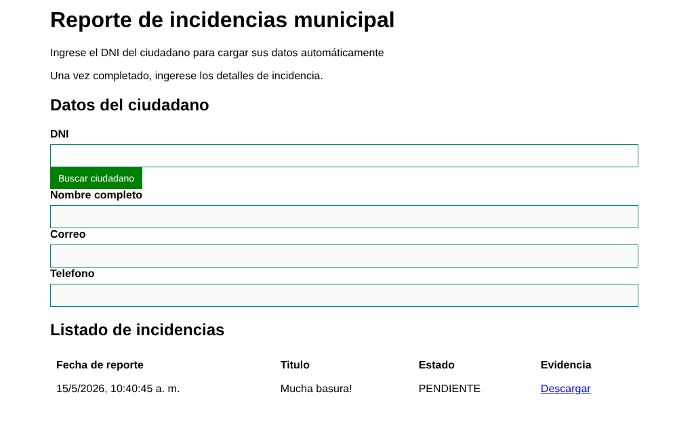

# Sistema de Registro de Incidencias



## Arquitectura

Se usa la arquitectura Modelo-Vista-Plantilla

### Backend

Se usa Django para definir los modelos de datos y la API con Django REST Framework.

### Frontend

Se usa directamente JavaScript, HTML y CSS básico para enviar y solicitar datos al backend.

## Instalación y configuración

## Requisitos previos

- Python 3.8 o superior
- pip (gestor de paquetes de Python)

### 1. Instalar dependencias

Recomendable iniciar un entorno virtual.

```bash
python -m venv .venv
source .venv/bin/activate(.zh)(.fish)(.sh)
pip install -r requirements.txt
```

### 2. Ejecutar migraciones de base de datos

```bash
python manage.py migrate
```

### 3. (Opcional) Crear un usuario administrador

```bash
python manage.py createsuperuser
```

Sigue las indicaciones del comando para crear un usuario con acceso al panel de administración.

### 4. Levantar el servidor de desarrollo

```bash
python manage.py runserver
```

El servidor estará disponible en: `http://localhost:8000/`

## Acceso a la aplicación

- **Sitio principal:** http://localhost:8000/
- **Panel de administración:** http://localhost:8000/admin/
- **API:** http://localhost:8000/api/
- **Swagger:** http://localhost:8000/api/docs

## Interacción

- En la base de datos se incluye un usuario con DNI 77799888 que puede usarse para publicar una incidencia.

## Estructura del proyecto

- `registro_incidencias/` - Aplicación principal del sistema
- `sistema_incidencias/` - Configuración del proyecto Django
- `documentación/` - Documentos de requisitos, historias de usuario, arquitectura.
- `documentación/casos_prueba/` - Evidencias de ejecución del proyecto y casos de prueba para cumplir con requisitos e historias de usuario.
- `db.sqlite3` - Base de datos SQLite