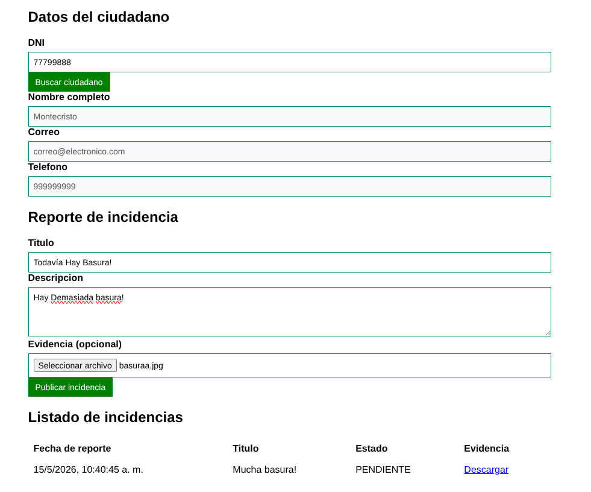
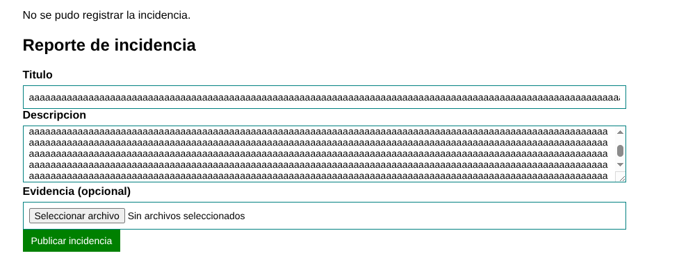
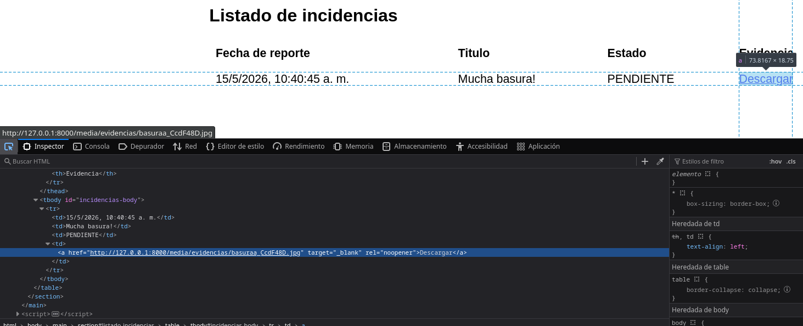
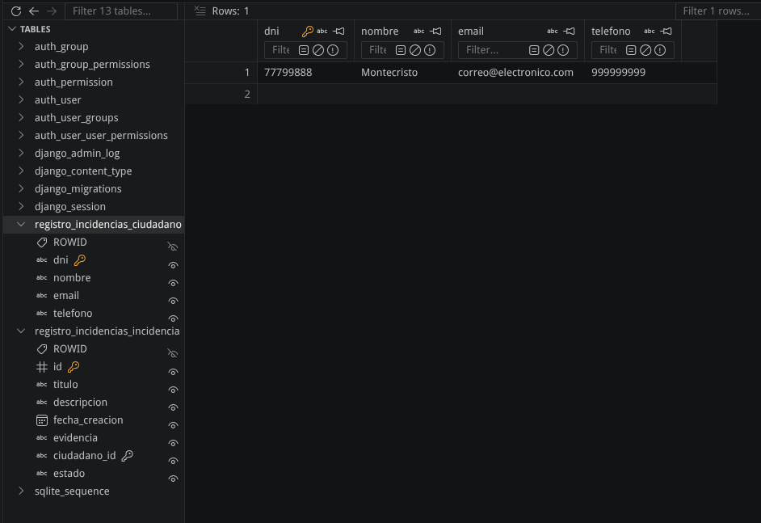
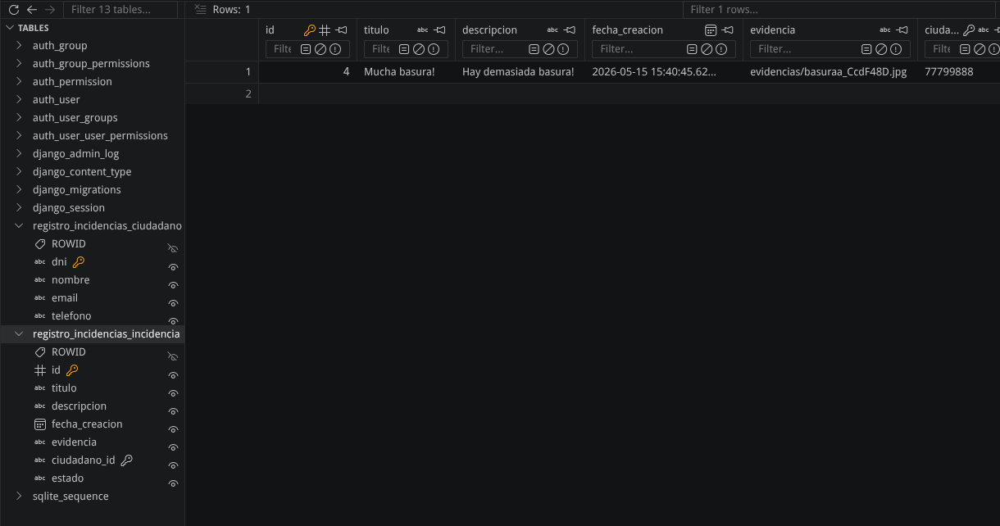

# Imagenes de evidencia de ejecución

## Cumplimiento de historias de usuario

- Se cumplen las historias de usuario especificadas con la siguiente imágenes:

Se probó que el usuario es capaz de buscarse a si mismo con su DNI, el usuario es capaz de escribir un título y descripción de incidencia y puede adjuntar imágenes de incidencia.

## Cumplimiento de requisitos

- La imagen en la sección de historias de usuario verifica el cumplimiento de los requisitos funcionales de verificación de incidencias en un listado y el uso de DNI para completar sus datos automáticamente (RF-03, RF-04).

- Se verificó que se cumplen los límites de 1000 caracteres especificados en los modelos y de 5MB de evidencias en el frontend (RF-01, RF-02).

- Se verificó que se muestran mensajes de error en caso se viole alguna restricción de seguridad (RU-01).

- Se verificó que se enlaza a la evidencia adjuntada en el listado de incidencias (RF-03).

- Se verificó que la base de datos define una tabla para ciudadanos y otra para incidencias. (RBD-1)

- Se verificó que el sistema de base de datos deberá almacenar en la tabla de incidencias el nombre de la incidencia subida. (RBD-2)

